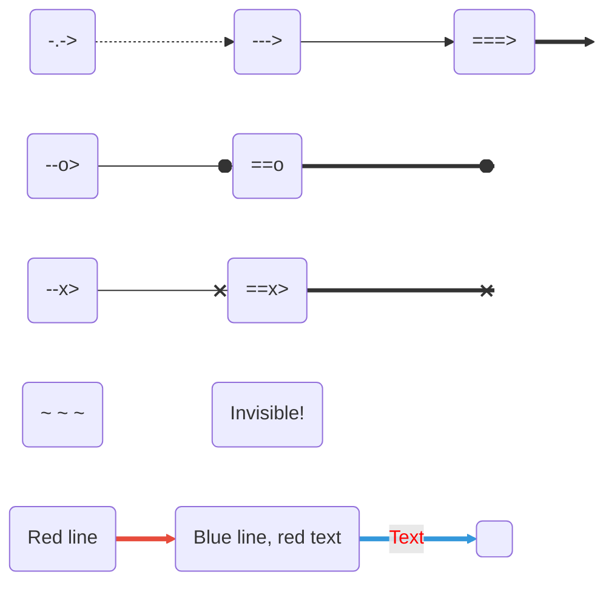
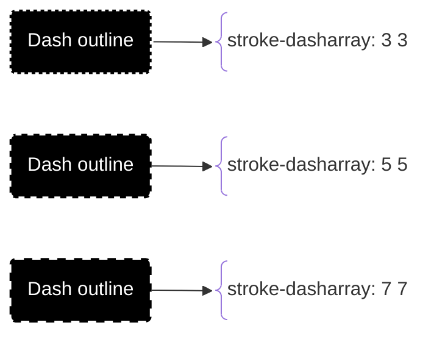

> Last updated August 3, 2025

# Mermaid

* [Colors](#colors)

# Mermaid: Node links

```mermaid
flowchart LR
    %% Components
    A@{shape: rounded, label: "-.->"}
    B@{shape: rounded, label: "--->"}
    C@{shape: rounded, label: "===>"}
    HiddenA@{shape: rounded}
    E@{shape: rounded, label: "--o>"}
    F@{shape: rounded, label: "==o"}
    HiddenB@{shape: rounded}
    H@{shape: rounded, label: "--x>"}
    I@{shape: rounded, label: "==x>"}
    HiddenC@{shape: rounded}
    J@{shape: rounded, label: ["~ ~ ~"]}
    K@{shape: rounded, label: "Invisible!"}
    L@{shape: rounded, label: "Red line"}
    M@{shape: rounded, label: "Blue line, red text"}
    N@{shape: rounded, label: " "}
    HiddenD@{shape: rounded}
    %% Layout
    A -.-> B --> C ==> HiddenA
    E --o F ==o HiddenB
    H --x I ==x HiddenC
    J ~~~ K
    L --> M -- Text --> N
    %% Styles
    classDef Hidden display: none;
    class HiddenA,HiddenB,HiddenC,HiddenD Hidden
    linkStyle 8 stroke:#e74c3c,stroke-width:4px,color:red;
    linkStyle 9 stroke:#3498db ,stroke-width:4px,color:red;
```

# Mermaid: Strokes

```mermaid
flowchart LR
  %% Components
  Dash3_3@{shape: rounded, label: "Dash outline"}
  Dash3_3String@{shape: brace, label: "stroke-dasharray: 3 3"}
  Dash5_5@{shape: rounded, label: "Dash outline"}
  Dash5_5String@{shape: brace, label: "stroke-dasharray: 5 5"}
  Dash7_7@{shape: rounded, label: "Dash outline"}
  Dash7_7String@{shape: brace, label: "stroke-dasharray: 7 7"}
  %% Layout
  Dash3_3 --> Dash3_3String
  Dash5_5 --> Dash5_5String
  Dash7_7 --> Dash7_7String
  %% Styles
  classDef Dash3_3 stroke:#ffffff,stroke-width:3px,stroke-dasharray: 3 3,fill:#000000,color:#ffffff
  class Dash3_3 Dash3_3
  classDef Dash5_5 stroke:#ffffff,stroke-width:3px,stroke-dasharray: 5 5,fill:#000000,color:#ffffff
  class Dash5_5 Dash5_5
  classDef Dash7_7 stroke:#ffffff,stroke-width:3px,stroke-dasharray: 7 7,fill:#000000,color:#ffffff
  class Dash7_7 Dash7_7
```
