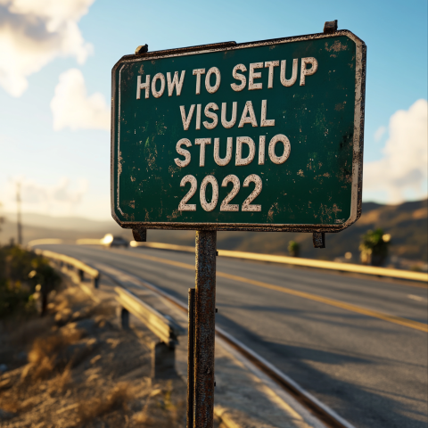

<!--
    Last updated: 241230
    TODO:
        Settings for:
            Better Comments
            Collapse Comments
            CoPilot
            Language - JSON
            Language - Markdown
            Language - Plain text
            Productivity Power Tools
            Viasfora
            VSColorOutput
            XAML Styler

-->

> **This document was last updated** December 30, 2024  

   <!--
    This image was created by Midjourney using the following prompt:
    "closeup of a highway sign with the words HOW TO SETUP VISUAL STUDIO 2022"
   -->
  

CONTENTS  
[Installing Visual Studio 2022]()  
[Installing Visual Studio 2022 extensions]()  
[Setting up Visual Studio 2022]()  

This document will walk through the steps I take to setup my Visual Studio 2022 environment for developing web services in C#.

# Installing Visual Studio 2022

Installing Visual Studio 2022 is pretty straight forward, just download the [installer](https://visualstudio.microsoft.com/vs/) and follow the prompts.

## Visual Studio Workflows

The bulk of the install process is choosing the workflows you will need for development.

For example, I've installed the following workflows for developing web services using C#:

* ASP.NET and web development
* Azure Development
* .NET Multi-platform APP UI development
* .NET desktop development

The workflows you specify will take care of the other components of the installation process.

# Installing Visual Studio 2022 extensions

These are the extensions I install. You may want/need to install other extensions.

To install an extension:

1. Go to `Extensions -> Manage Extensions...`
2. Click the `Browse` tab
3. Search for the extension name
4. Click "Install"

## Recommended extensions

Microsoft has an extension pack that contains a bunch of individual extensions that are pretty great:

* [Productivity Power Tools 2022](https://marketplace.visualstudio.com/items?itemName=VisualStudioPlatformTeam.ProductivityPowerPack2022)
  * Align Assignments 2022
  * Double-Click Maximize 2022
  * Copy As Html 2022
  * Fix Mixed Tabs 2022
  * Match Margin 2022
  * Middle-Click Scroll 2022
  * Peek Help 2022
  * Shrink Empty Lines 2022
  * Solution Error Visualizer 2022
  * Time Stamp Margin 2022

[Mads Kristensen](https://www.madskristensen.net/) is a Principal Product Manager for Visual Studio, and has made some awesome extensions:

* [Add New File (64-bit)](https://marketplace.visualstudio.com/items?itemName=MadsKristensen.AddNewFile64)
* [Clean Solution](https://marketplace.visualstudio.com/items?itemName=MadsKristensen.CleanSolution)
* [Color Preview](https://marketplace.visualstudio.com/items?itemName=MadsKristensen.ColorPreview)
* [Editor Enhancements](https://marketplace.visualstudio.com/items?itemName=MadsKristensen.EditorEnhancements64)
* [File Differ](https://marketplace.visualstudio.com/items?itemName=MadsKristensen.FileDiffer)
* [File Icons](https://marketplace.visualstudio.com/items?itemName=MadsKristensen.FileIcons)
* [Image Optimizer (64-bit)](https://marketplace.visualstudio.com/items?itemName=MadsKristensen.ImageOptimizer64bit)
* [Image Preview](https://marketplace.visualstudio.com/items?itemName=MadsKristensen.ImagePreview)
* [Markdown Editor v2](https://marketplace.visualstudio.com/items?itemName=MadsKristensen.MarkdownEditor2)
* [Show Selection Length](https://marketplace.visualstudio.com/items?itemName=MadsKristensen.ShowSelectionLength)
* [Solution Colors](https://marketplace.visualstudio.com/items?itemName=MadsKristensen.SolutionColors)
* [Trailing Whitespace Visualizer](https://marketplace.visualstudio.com/items?itemName=MadsKristensen.TrailingWhitespace64)
* [Tweaks 2022](https://marketplace.visualstudio.com/items?itemName=MadsKristensen.Tweaks2022)

And a few other useful extensions:

* [Better Comments](https://marketplace.visualstudio.com/items?itemName=OmarRwemi.BetterCommentsVS2022)
* [Collapse Comments](https://marketplace.visualstudio.com/items?itemName=MattLaceyLtd.CollapseComments)
* [Editor Guidelines](https://marketplace.visualstudio.com/items?itemName=PaulHarrington.EditorGuidelinesPreview)
* [Roslynator 2022](https://marketplace.visualstudio.com/items?itemName=josefpihrt.Roslynator2022)
* [Viasfora](https://marketplace.visualstudio.com/items?itemName=TomasRestrepo.Viasfora)
* [Visual Studio Spell Checker (VS2022 and Later)](https://marketplace.visualstudio.com/items?itemName=EWoodruff.VisualStudioSpellCheckerVS2022andLater)
* [VSColorOutput64](https://marketplace.visualstudio.com/items?itemName=MikeWard-AnnArbor.VSColorOutput64)
* [XAML Styler for Visual Studio 2022](https://marketplace.visualstudio.com/items?itemName=TeamXavalon.XAMLStyler2022)

## Themes

Themes/color schemes/etc. are a personal choice. I use these:

* [Dracula Official](https://marketplace.visualstudio.com/items?itemName=dracula-theme.dracula)
* [Synthwave '84 Reborn](https://marketplace.visualstudio.com/items?itemName=Fasteroid.Synthwave84VS)

## Optional extensions

There are a few extensions I install that I generally leave disabled, and only use in specific cases:

* [Pretty Doc Comments](https://marketplace.visualstudio.com/items?itemName=OlivierJacot-Descombes.PrettyDocComments)  
  If you use a lot of inline XML documentation, this can help visualize what it looks like when you use an external documentation formatter like [Sandcastle](https://ewsoftware.github.io/SHFB/html/bd1ddb51-1c4f-434f-bb1a-ce2135d3a909.htm). It does make things a bit more noisy when coding, so I leave it disabled unless I am working on documentation.

* [Code Cleanup On Save](https://marketplace.visualstudio.com/items?itemName=MadsKristensen.CodeCleanupOnSave)  
  This is a helpful extension *if you have setup your Code Cleanup profiles*.

* [Comment Remover](https://marketplace.visualstudio.com/items?itemName=MadsKristensen.CommentRemover)  
  Cool idea, probably pretty dangerous.

* [SonarQube for Visual Studio 2022](https://marketplace.visualstudio.com/items?itemName=SonarSource.SonarLintforVisualStudio2022)

# Configuring Visual Studio 2022 - Options

The majority of Visual Studio's configuration will be done in the `Options` window, which you can get to by going to `Tools -> Options...`

Things to remember about this list:

* It contains screenshots of settings that are either modified, or are kept for historical reasons.
* Non-modified option pages are excluded (otherwise this list would be too long).
* These modifications are what I use for C#/web service development. You may want/need to make additional modifications.

## Visual Studio specific

* Environment
  * [**General**](./screenshots/settings-environment-general-01.png)
  * [**Accounts**](./screenshots/settings-environment-accounts-01.png)
  * [**AutoRecover**](./screenshots/settings-environment-autorecover-01.png)
  * [**Clean Solution**](./screenshots/settings-environment-clean-solution-01.png)
  * [**Documents**](./screenshots/settings-environment-documents-01.png)
  * [**Extensions**](./screenshots/settings-environment-extensions-01.png)
  * [**Find and Replace**](./screenshots/settings-environment-find-and-replace-01.png)
  * **Fonts and Colors** ([details]())
  * [**Tabs and Windows**](./screenshots/settings-environment-tabs-and-windows-01.png)
  * [**Trailing Whitespace**](./screenshots/settings-environment-trailing-whitespace-01.png)
  * [**Task List**](./screenshots/settings-environment-task-list-01.png)
  * [**Tweaks 2022**](./screenshots/settings-environment-tweaks-2022-01.png)
* Projects and Solutions
  * [**General**](./screenshots/settings-projects-and-solutions-general-01.png)
  * [**Build and Run**](./screenshots/settings-projects-and-solutions-build-and-run-01.png)
* Text Editor
  * [**General**](./screenshots/settings-text-editor-general-01.png)
  * [**Advanced**](./screenshots/settings-text-editor-advanced-01.png)
  * **Code Cleanup** ([details]())
  * All Languages
    * [**General**](./screenshots/settings-text-editor-all-languages-general-01.png)
    * [**Scroll Bars**](./screenshots/settings-text-editor-all-languages-scroll-bars-01.png)
    * [**Tabs**](./screenshots/settings-text-editor-all-languages-tabs-01.png)
  * C#
    * **Advanced** [1](./screenshots/settings-text-editor-csharp-advanced-01.png) | [2](./screenshots/settings-text-editor-csharp-advanced-02.png)
    * **Code Style** ([details]())
    * [**Intellisense**](./screenshots/settings-text-editor-csharp-intellisense-01.png)
  * JSON
  * Markdown
  * Plain Text
  * XAML
    * Formatting
      * [**General**](./screenshots/settings-text-editor-xaml-formatting-general-01.png)
      * [**Spacing**](./screenshots/settings-text-editor-xaml-formatting-spacing-01.png)
    * [**Miscellaneous**](./screenshots/settings-text-editor-xaml-miscellaneous-01.png)
  * GitHub
    * [CoPilot]()

## Extension specific

* [Better Comments]()
* [Collapse Comments]()
* [Editor Guidelines]()
* [Productivity Power Tools]()
* [Viasfora]()
* [VSColorOutput64]()
* [XAML Styler]()
