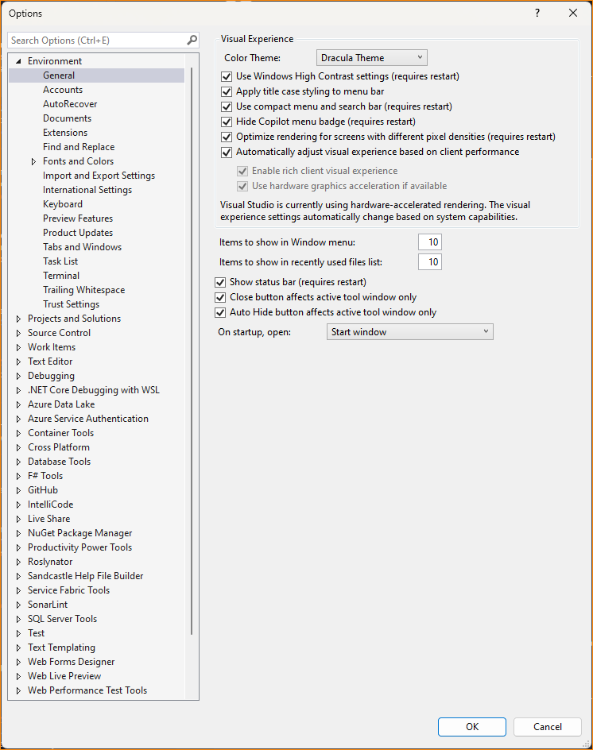
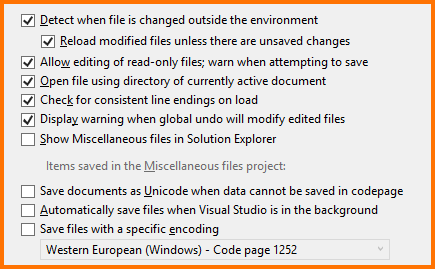
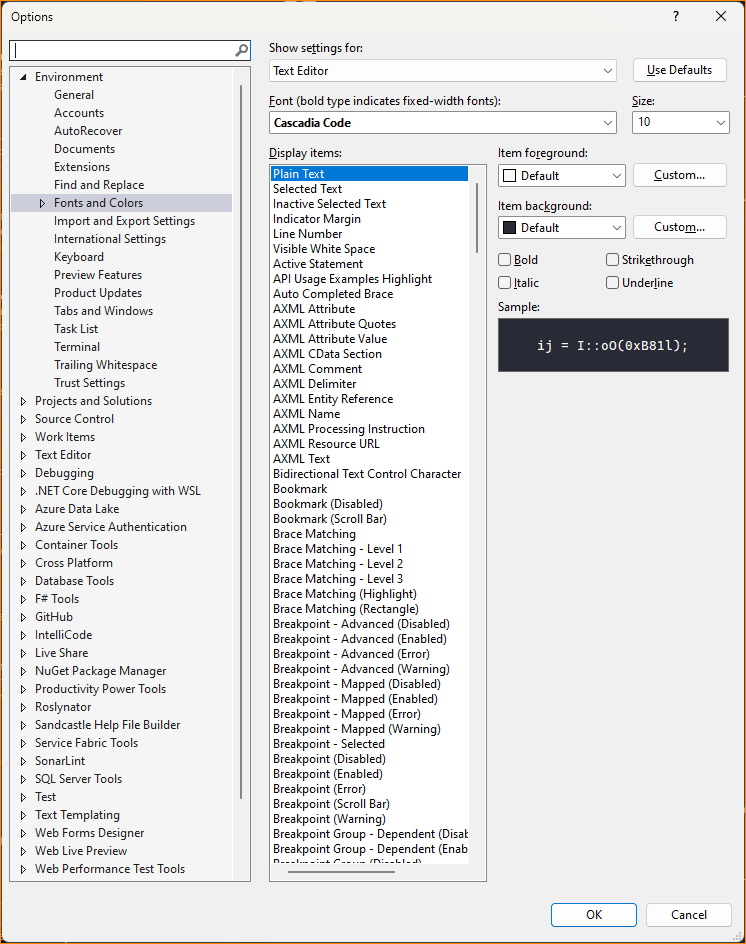
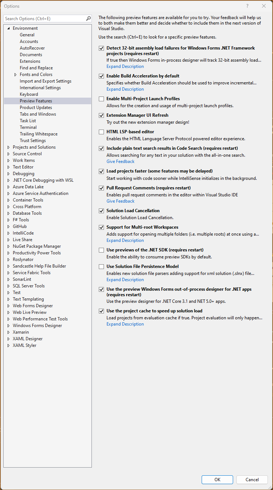
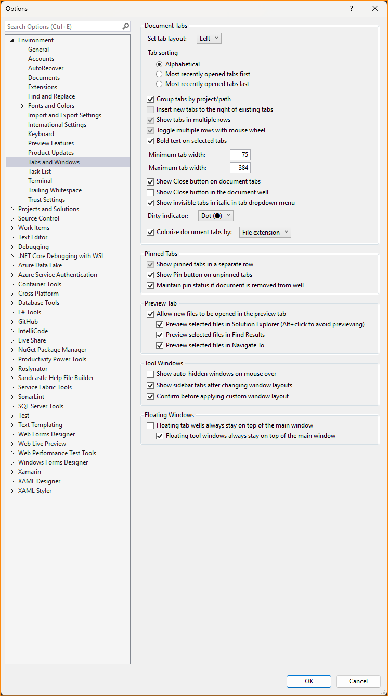
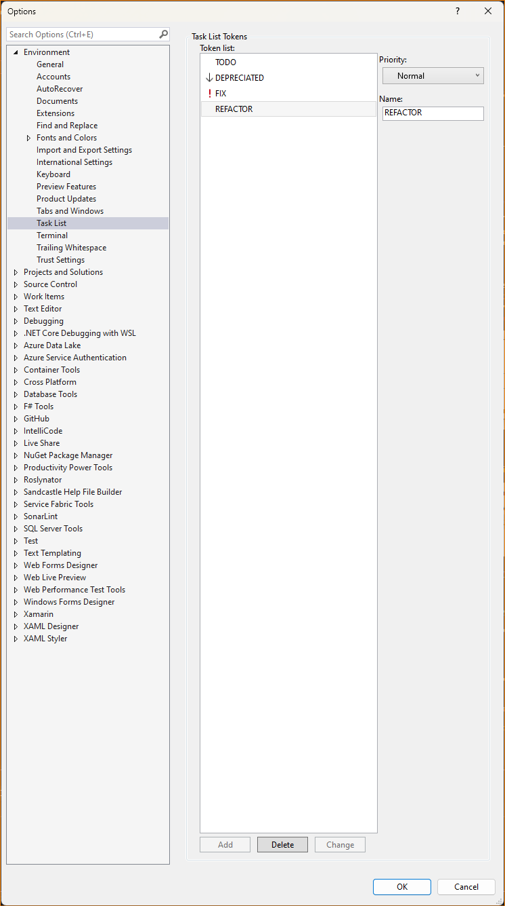
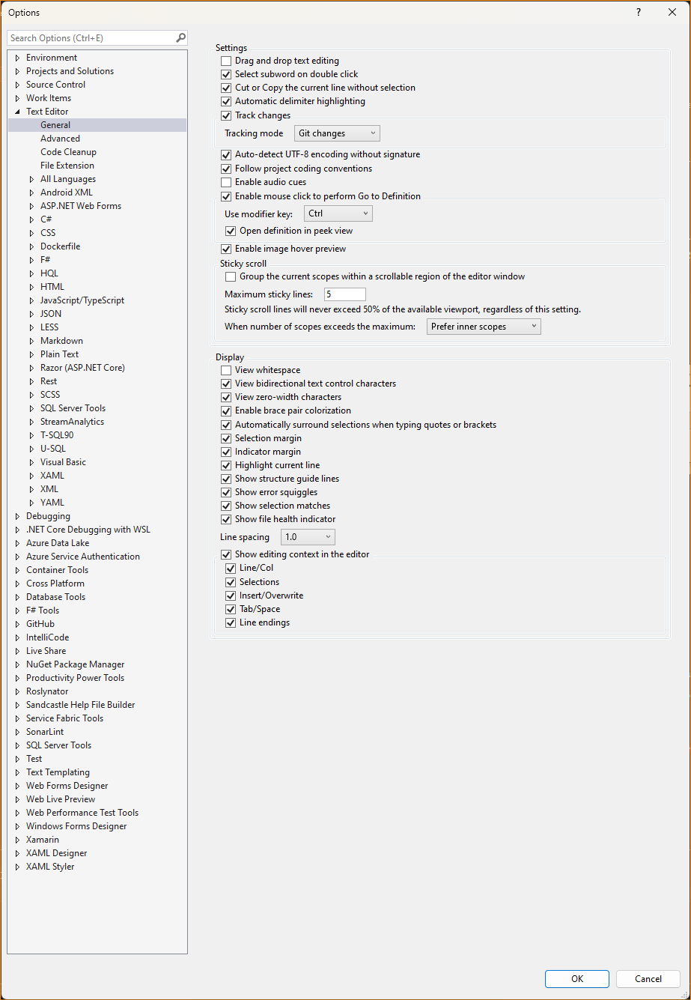

# Visual Studio 2022 Setup

This will detail the setup of Visual Studio Community 2022 v17.12.3 with the following components:

* ASP.NET and web development
* Azure Development
* .NET desktop development
* .NET Multi-platform APP UI development
* Windows application development

## View menu

Enable these windows/components:

### Left dock

* Solution Explorer
* Toolbox
* Properties

### Right dock

Empty

### Bottom dock

* Error List
* Output
* Task List
* Bookmarks

***

## Extensions, Part One

These are the default extensions that come with Visual Studio, and should be the only extensions that are installed:

* ML.NET Model Builder 2022
* Live Share 2022
* Single-project MSIX Packaging Tools
* SQL Server Data Tools - Sql Editor
* Xamarin.Android.SDK
* Web Live Preview
* Microsoft Library Manager

***

## Options

Using the `Tools` > `Options` menu:

### Environment > General

Notes:

* The "Color Theme" cannot be changed to "Dracula Theme" untilthe Dracula Theme has been installed.

### Environment > Documents

### Environment > Fonts and Colors

### Environment > Preview Settings

### Environment > Tabs and Windows

### Environment > Task List

### Text Editor > General

