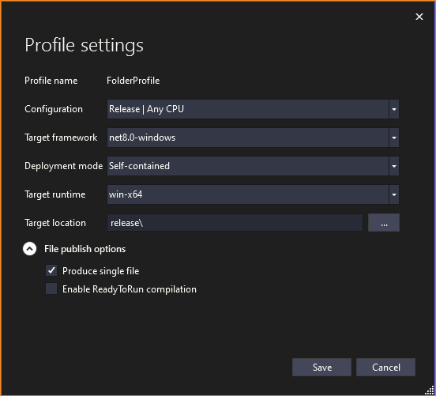
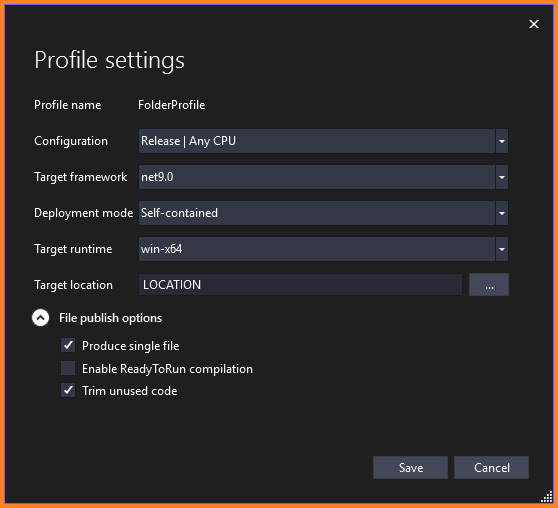

# How to publish as a single file

1. Right-click on the project you want to publish, and choose "Publish"
2. Click "Add a publish profile"
3. For the Target, choose "Folder"
4. Choose the Specific target, choose "Folder"
5. Choose a folder location to publish to.

For example:

`release\`

6. Click "Close"
7. Click "Show all settings"

WPF projects should look like this:



Console projects should look like this:



8. Click "Save".

9. Add the following to the .csproj file:

```csharp
<PropertyGroup>
    <DebugType>embedded</DebugType>
    <Version>1.0.0</Version>
    <FileVersion>1.0.0</FileVersion>
</PropertyGroup>
```

## Multi-project solutions

If a solution has multiple projects, each project needs to be published.

# More

https://learn.microsoft.com/en-us/dotnet/core/deploying/
