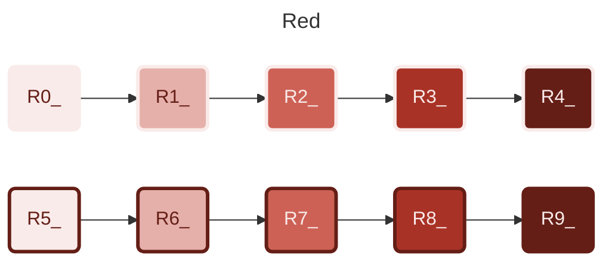
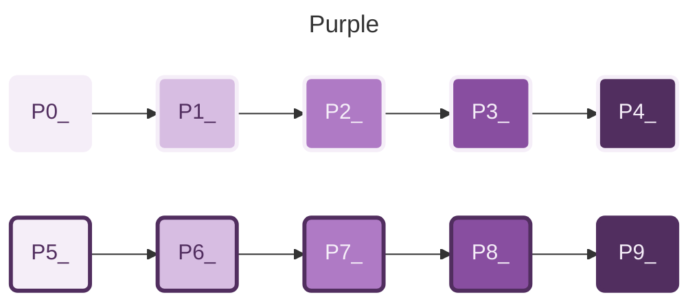
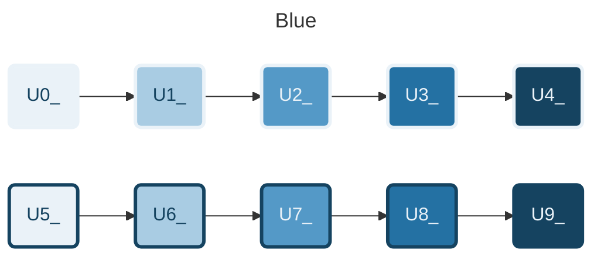
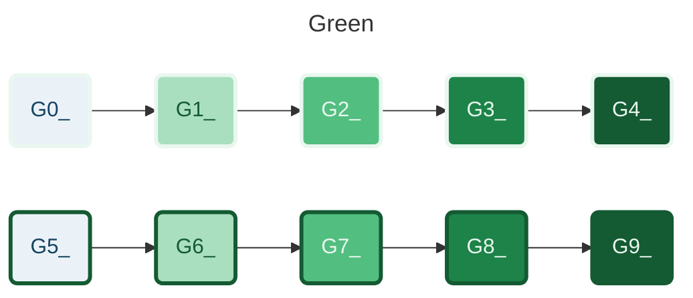
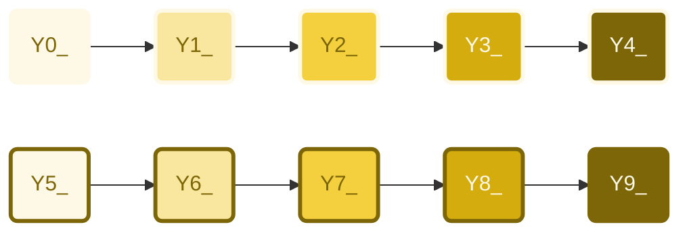
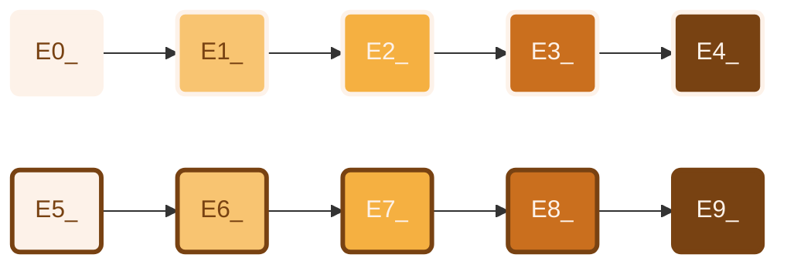
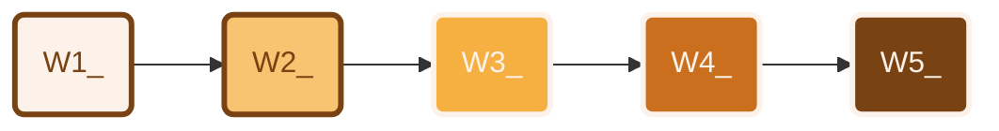
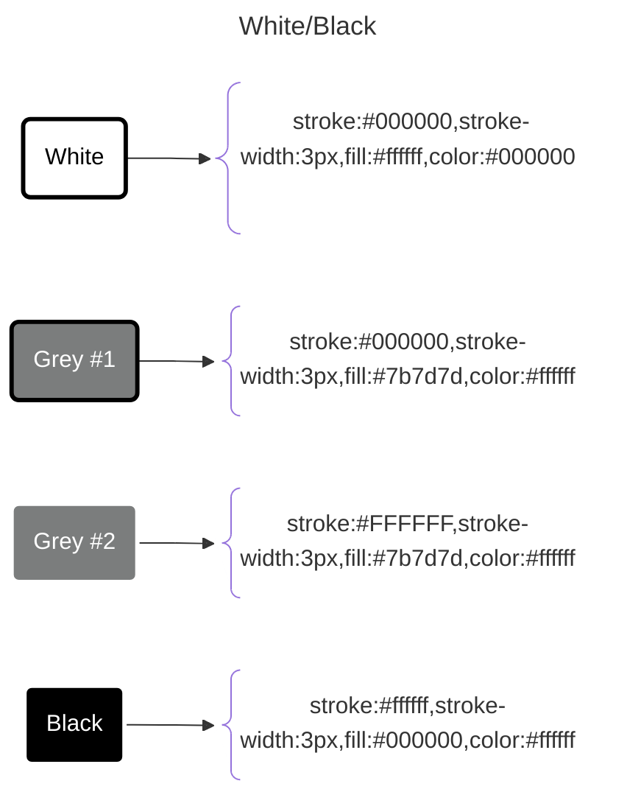
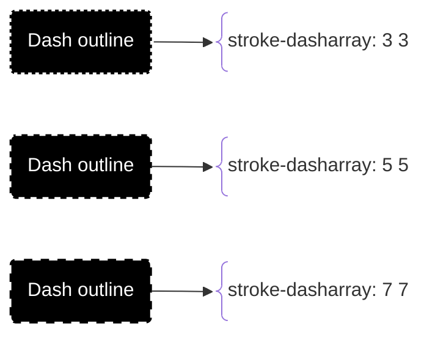
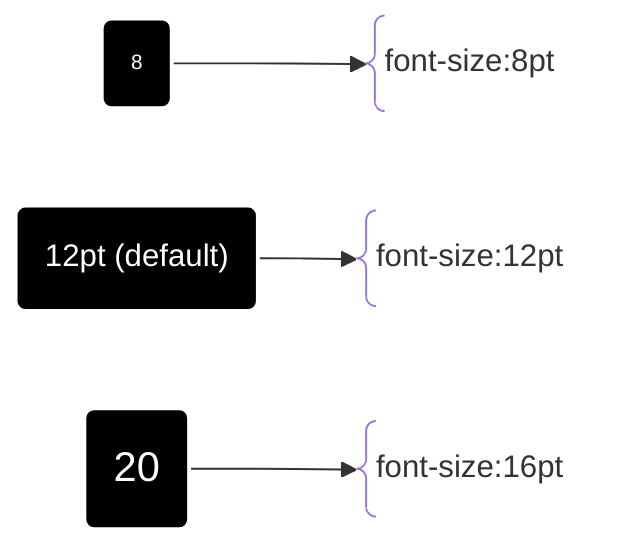

<!-- u250303  -->

# Mermaid colors



```text
  classDef R0_ stroke:#f9ebea,stroke-width:3px,fill:#f9ebea,color:#641e16
  classDef R1_ stroke:#f9ebea,stroke-width:3px,fill:#E6B0AA,color:#641e16
  classDef R2_ stroke:#f9ebea,stroke-width:3px,fill:#CD6155,color:#f9ebea
  classDef R3_ stroke:#f9ebea,stroke-width:3px,fill:#A93226,color:#f9ebea
  classDef R4_ stroke:#f9ebea,stroke-width:3px,fill:#641e16,color:#f9ebea
  classDef R5_ stroke:#641e16,stroke-width:3px,fill:#f9ebea,color:#641e16
  classDef R6_ stroke:#641e16,stroke-width:3px,fill:#E6B0AA,color:#641e16
  classDef R7_ stroke:#641e16,stroke-width:3px,fill:#CD6155,color:#f9ebea
  classDef R8_ stroke:#641e16,stroke-width:3px,fill:#A93226,color:#f9ebea
  classDef R9_ stroke:#641e16,stroke-width:3px,fill:#641e16,color:#f9ebea
```



```text
  classDef P0_ stroke:#f5eef8,stroke-width:3px,fill:#f5eef8,color:#512e5f
  classDef P1_ stroke:#f5eef8,stroke-width:3px,fill:#d7bde2,color:#512e5f
  classDef P2_ stroke:#f5eef8,stroke-width:3px,fill:#af7ac5,color:#f5eef8
  classDef P3_ stroke:#f5eef8,stroke-width:3px,fill:#884ea0,color:#f5eef8
  classDef P4_ stroke:#f5eef8,stroke-width:3px,fill:#512e5f,color:#f5eef8
  classDef P5_ stroke:#512e5f,stroke-width:3px,fill:#f5eef8,color:#512e5f
  classDef P6_ stroke:#512e5f,stroke-width:3px,fill:#d7bde2,color:#512e5f
  classDef P7_ stroke:#512e5f,stroke-width:3px,fill:#af7ac5,color:#f5eef8
  classDef P8_ stroke:#512e5f,stroke-width:3px,fill:#884ea0,color:#f5eef8
  classDef P9_ stroke:#512e5f,stroke-width:3px,fill:#512e5f,color:#f5eef8
```



```text
  classDef U0_ stroke:#eaf2f8,stroke-width:3px,fill:#eaf2f8,color:#154360
  classDef U1_ stroke:#eaf2f8,stroke-width:3px,fill:#a9cce3,color:#154360
  classDef U2_ stroke:#eaf2f8,stroke-width:3px,fill:#5499c7,color:#eaf2f8
  classDef U3_ stroke:#eaf2f8,stroke-width:3px,fill:#2471a3,color:#eaf2f8
  classDef U4_ stroke:#eaf2f8,stroke-width:3px,fill:#154360,color:#eaf2f8
  classDef U5_ stroke:#154360,stroke-width:3px,fill:#eaf2f8,color:#154360
  classDef U6_ stroke:#154360,stroke-width:3px,fill:#a9cce3,color:#154360
  classDef U7_ stroke:#154360,stroke-width:3px,fill:#5499c7,color:#eaf2f8
  classDef U8_ stroke:#154360,stroke-width:3px,fill:#2471a3,color:#eaf2f8
  classDef U9_ stroke:#154360,stroke-width:3px,fill:#154360,color:#eaf2f8
```



```text
  classDef G0_ stroke:#e9f7ef,stroke-width:3px,fill:#eaf2f8,color:#154360
  classDef G1_ stroke:#e9f7ef,stroke-width:3px,fill:#a9dfbf,color:#145a32
  classDef G2_ stroke:#e9f7ef,stroke-width:3px,fill:#52be80,color:#e9f7ef
  classDef G3_ stroke:#e9f7ef,stroke-width:3px,fill:#1d8348,color:#e9f7ef
  classDef G4_ stroke:#e9f7ef,stroke-width:3px,fill:#145a32,color:#e9f7ef
  classDef G5_ stroke:#145a32,stroke-width:3px,fill:#eaf2f8,color:#154360
  classDef G6_ stroke:#145a32,stroke-width:3px,fill:#a9dfbf,color:#145a32
  classDef G7_ stroke:#145a32,stroke-width:3px,fill:#52be80,color:#e9f7ef
  classDef G8_ stroke:#145a32,stroke-width:3px,fill:#1d8348,color:#e9f7ef
  classDef G9_ stroke:#145a32,stroke-width:3px,fill:#145a32,color:#e9f7ef
```



```text
  classDef Y0_ stroke:#fef9e7,stroke-width:3px,fill:#fef9e7,color:#7d6608
  classDef Y1_ stroke:#fef9e7,stroke-width:3px,fill:#f9e79f,color:#7d6608
  classDef Y2_ stroke:#fef9e7,stroke-width:3px,fill:#f4d03f,color:#7d6608
  classDef Y3_ stroke:#fef9e7,stroke-width:3px,fill:#d4ac0d,color:#fef9e7
  classDef Y4_ stroke:#fef9e7,stroke-width:3px,fill:#7d6608,color:#fef9e7
  classDef Y5_ stroke:#7d6608,stroke-width:3px,fill:#fef9e7,color:#7d6608
  classDef Y6_ stroke:#7d6608,stroke-width:3px,fill:#f9e79f,color:#7d6608
  classDef Y7_ stroke:#7d6608,stroke-width:3px,fill:#f4d03f,color:#7d6608
  classDef Y8_ stroke:#7d6608,stroke-width:3px,fill:#d4ac0d,color:#fef9e7
  classDef Y9_ stroke:#7d6608,stroke-width:3px,fill:#7d6608,color:#fef9e7
```



```text
  classDef E0_ stroke:#fdf2e9,stroke-width:3px,fill:#fdf2e9,color:#784212
  classDef E1_ stroke:#fdf2e9,stroke-width:3px,fill:#f8c471,color:#784212  
  classDef E2_ stroke:#fdf2e9,stroke-width:3px,fill:#f5b041,color:#fdf2e9
  classDef E3_ stroke:#fdf2e9,stroke-width:3px,fill:#ca6f1e,color:#fdf2e9
  classDef E4_ stroke:#fdf2e9,stroke-width:3px,fill:#784212,color:#fdf2e9
  classDef E5_ stroke:#784212,stroke-width:3px,fill:#fdf2e9,color:#784212
  classDef E6_ stroke:#784212,stroke-width:3px,fill:#f8c471,color:#784212  
  classDef E7_ stroke:#784212,stroke-width:3px,fill:#f5b041,color:#fdf2e9
  classDef E8_ stroke:#784212,stroke-width:3px,fill:#ca6f1e,color:#fdf2e9
  classDef E9_ stroke:#784212,stroke-width:3px,fill:#784212,color:#fdf2e9
```



```text
  classDef E1_ stroke:#784212,stroke-width:3px,fill:#fdf2e9,color:#784212
  classDef E2_ stroke:#784212,stroke-width:3px,fill:#f8c471,color:#784212  
  classDef E3_ stroke:#fdf2e9,stroke-width:3px,fill:#f5b041,color:#fdf2e9
  classDef E4_ stroke:#fdf2e9,stroke-width:3px,fill:#ca6f1e,color:#fdf2e9
  classDef E5_ stroke:#fdf2e9,stroke-width:3px,fill:#784212,color:#fdf2e9
```




## Outline



## Font size


