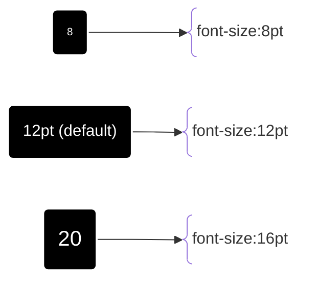

<!-- u250303  -->

# Mermaid: Fonts

## Font size

```mermaid
flowchart LR
  %% Components
  FontPoint8@{shape: rounded, label: "8"}
  FontPoint8String@{shape: brace, label: "font-size:8pt"}
  FontPoint12@{shape: rounded, label: "12pt (default)"}
  FontPoint12String@{shape: brace, label: "font-size:12pt"}
  FontPoint16@{shape: rounded, label: "20"}
  FontPoint16String@{shape: brace, label: "font-size:16pt"}
  %% Layout
  FontPoint8 --> FontPoint8String
  FontPoint12 --> FontPoint12String
  FontPoint16 --> FontPoint16String
  %% Styles
  classDef FontPoint8 stroke:#ffffff,stroke-width:2px,fill:#000000,color:#ffffff,font-size:8pt
  class FontPoint8 FontPoint8
  classDef FontPoint12 stroke:#ffffff,stroke-width:2px,fill:#000000,color:#ffffff,font-size:12pt
  class FontPoint12 FontPoint12
  classDef FontPoint16 stroke:#ffffff,stroke-width:2px,fill:#000000,color:#ffffff,font-size:16pt
  class FontPoint16 FontPoint16
```
