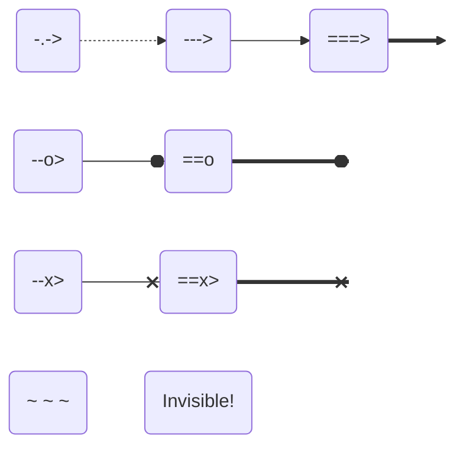

<!-- u250303  -->

# Mermaid: Node links

```mermaid
flowchart LR
    %% Components
    A@{shape: rounded, label: "-.->"}
    B@{shape: rounded, label: "--->"}
    C@{shape: rounded, label: "===>"}
    HiddenA@{shape: rounded}
    E@{shape: rounded, label: "--o>"}
    F@{shape: rounded, label: "==o"}
    HiddenB@{shape: rounded}
    H@{shape: rounded, label: "--x>"}
    I@{shape: rounded, label: "==x>"}
    HiddenC@{shape: rounded}
    J@{shape: rounded, label: ["~ ~ ~"]}
    K@{shape: rounded, label: "Invisible!"}

    %% Layout
    A -.-> B --> C ==> HiddenA
    E --o F ==o HiddenB
    H --x I ==x HiddenC
    J ~~~ K
    %% Styles
    classDef Hidden display: none;
    class HiddenA,HiddenB,HiddenC Hidden
```
