# Mermaid shapes

## Comments and text

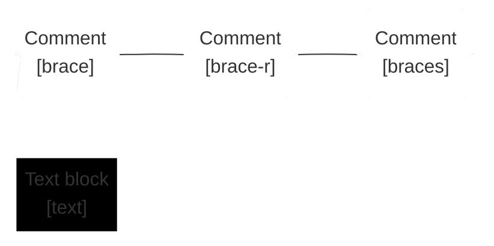
```mermaid
flowchart LR
    %% Components
    Comment@{shape: brace, label: "Comment\n[brace]"}
    CommentRight@{shape: brace-r, label: "Comment\n[brace-r]"}
    CommentBoth@{shape: braces, label: "Comment\n[braces]"}
    TextBlock@{shape: text, label: "Text block\n[text]"}
    %% Layout
    Comment --- CommentRight --- CommentBoth
    TextBlock
    %% Styles
    classDef default fill:#000, stroke:#FFF, stroke-width:1px

```

# Data

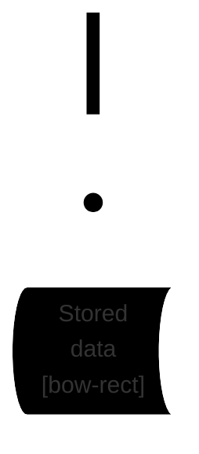
```mermaid
flowchart LR
    %% Components
    ForkJoin@{shape: fork, label: "Fork/Join\n[fork]"}
    Junction@{shape: f-circ, label: "Junction\n[f-circ]"}
    StoredData@{shape: bow-rect, label: "Stored\ndata\n[bow-rect]"}
    %% Layout
    ForkJoin
    Junction
    StoredData
    %% Styles
    classDef default fill:#000, stroke:#FFF, stroke-width:1px
```

# Documents

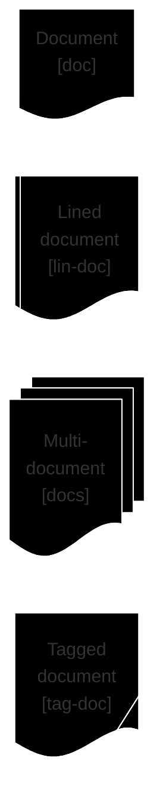
```mermaid
flowchart LR
    %% Components
    Document@{shape: doc, label: "Document\n[doc]"}
    LinedDocument@{shape: lin-doc, label: "Lined\ndocument\n[lin-doc]"}
    MultiDocument@{shape: docs, label: "Multi-\ndocument\n[docs]"}
    TaggedDocument@{shape: tag-doc, label: "Tagged\ndocument\n[tag-doc]"}
    %% Layout
    Document
    LinedDocument
    MultiDocument
    %% Styles
    classDef default fill:#000, stroke:#FFF, stroke-width:1px
```

# Files

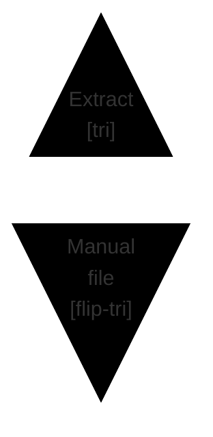
```mermaid
flowchart LR
    %% Components
    Extract@{shape: tri, label: "Extract\n[tri]"}
    ManualFile@{shape: flip-tri, label: "Manual\nfile\n[flip-tri]"}
    %% Layout
    Extract
    ManualFile
    %% Styles
    classDef default fill:#000, stroke:#FFF, stroke-width:1px
```

## Input/output

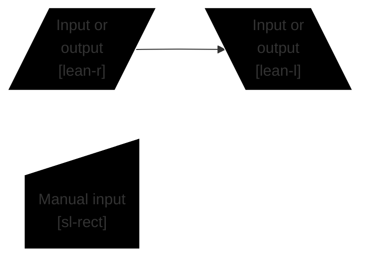
```mermaid
flowchart LR
    %% Components
    DataInputOutputRight@{shape: lean-r, label: "Input or\noutput\n[lean-r]"}
    DataInputOutputLeft@{shape: lean-l, label: "Input or\noutput\n[lean-l]"}
    ManualInput@{shape: sl-rect, label: "Manual input\n[sl-rect]"}
    %% Layout
    DataInputOutputRight --> DataInputOutputLeft
    ManualInput
    %% Styles
    classDef default fill:#000, stroke:#FFF, stroke-width:1px
```

# Interaction

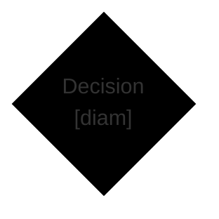
```mermaid
flowchart LR
    %% Components
    Decision@{shape: diam, label: "Decision\n[diam]"}
    %% Layout
    Decision
    %% Styles
    classDef default fill:#000, stroke:#FFF, stroke-width:1px
```

# Operations

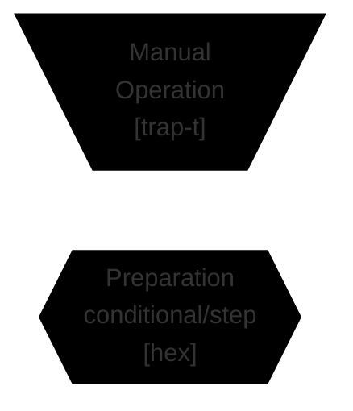
```mermaid
flowchart LR
    %% Components
    ManualOperation@{shape: trap-t, label: "Manual\nOperation\n[trap-t]"}
    PrepareConditional@{shape: hex, label: "Preparation\nconditional/step\n[hex]"}
    %% Layout
    ManualOperation
    PrepareConditional
    %% Styles
    classDef default fill:#000, stroke:#FFF, stroke-width:1px
```

# Other

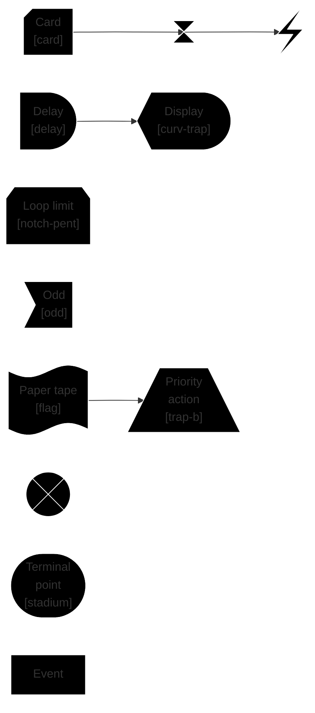
```mermaid
flowchart LR
    %% Components
    Card@{shape: card, label: "Card\n[card]"}
    Collate@{shape: hourglass, label: "Collate\noperation\n[hourglass]"}
    ComLink@{shape: bolt, label: "Communication\nlink\n[bolt]"}
    Delay@{shape: delay, label: "Delay\n[delay]"}
    Display@{shape: curv-trap, label: "Display\n[curv-trap]"}
    LoopLimit@{shape: notch-pent, label: "Loop limit\n[notch-pent]"}
    Odd@{shape: odd, label: "Odd\n[odd]"}
    PaperTape@{shape: flag, label: "Paper tape\n[flag]"}
    PriorityAction@{shape: trap-b, label: "Priority\naction\n[trap-b]"}
    Summary@{shape: cross-circ, label: "Summary\n[cross-circ]"}
    TerminalPoint@{shape: stadium, label: "Terminal\npoint\n[stadium]"}
    %% Layout
    Card --> Collate --> ComLink
    Delay -->Display
    Event
    LoopLimit
    Odd
    PaperTape --> PriorityAction
    Summary
    TerminalPoint
    %% Styles
    classDef default fill:#000, stroke:#FFF, stroke-width:1px
```

# Processes_

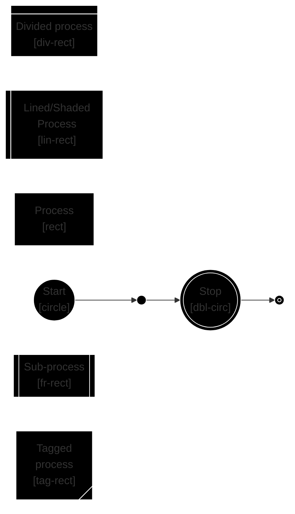
```mermaid
flowchart LR
    %% Components
    DividedProcess@{shape: div-rect, label: "Divided process\n[div-rect]"}
    LinedShadedProcess@{shape: lin-rect, label: "Lined/Shaded\nProcess\n[lin-rect]"}
    Process@{shape: rect, label: "Process\n[rect]"}
    Start@{shape: circle, label: "Start\n[circle]"}
    StartSmall@{shape: sm-circ, label: "Start\n[sm-circ]"}
    Stop@{shape: dbl-circ, label: "Stop\n[dbl-circ]"}
    StopSmall@{shape: fr-circ, label: "Stop\n[fr-circ]"}
    SubProcess@{shape: fr-rect, label: "Sub-process\n[fr-rect]"}
    TaggedProcess@{shape: tag-rect, label: "Tagged\nprocess\n[tag-rect]"}
    %% Layout
    DividedProcess
    LinedShadedProcess
    Process
    Start --> StartSmall --> Stop --> StopSmall
    SubProcess
    TaggedProcess
    %% Styles
    classDef default fill:#000, stroke:#FFF, stroke-width:1px
```

## Processes

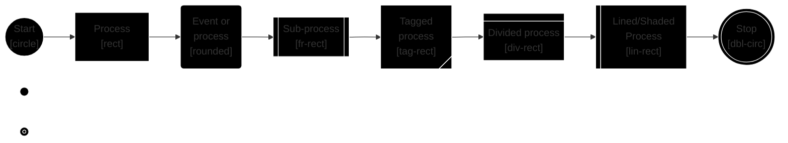
```mermaid
flowchart LR
    %% Components
    DividedProcess@{shape: div-rect, label: "Divided process\n[div-rect]"}
    Event@{shape: rounded, label: "Event or\nprocess\n[rounded]"}
    LinedShadedProcess@{shape: lin-rect, label: "Lined/Shaded\nProcess\n[lin-rect]"}
    Process@{shape: rect, label: "Process\n[rect]"}
    Start@{shape: circle, label: "Start\n[circle]"}
    StartSmall@{shape: sm-circ, label: "Start\n[sm-circ]"}
    Stop@{shape: dbl-circ, label: "Stop\n[dbl-circ]"}
    StopSmall@{shape: fr-circ, label: "Stop\n[fr-circ]"}
    SubProcess@{shape: fr-rect, label: "Sub-process\n[fr-rect]"}
    TaggedProcess@{shape: tag-rect, label: "Tagged\nprocess\n[tag-rect]"}
    %% Layout
    Start --> Process --> Event --> SubProcess --> TaggedProcess --> DividedProcess --> LinedShadedProcess--> Stop


    
    
    %% Styles
    classDef default fill:#000, stroke:#FFF, stroke-width:1px
```

# Storage

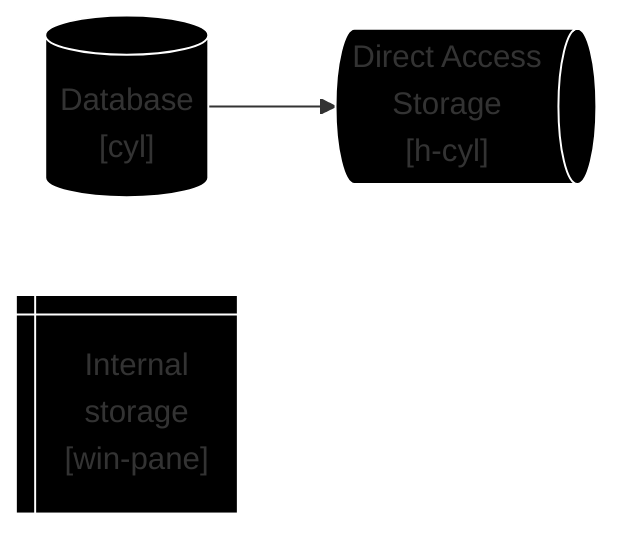
```mermaid
flowchart LR
    %% Component
    Database@{shape: cyl, label: "Database\n[cyl]"}
    DirectAccessStorage@{shape: h-cyl, label: "Direct Access\nStorage\n[h-cyl]"}
    InternalStorage@{shape: win-pane, label: "Internal\nstorage\n[win-pane]"}
    %% Layout
    Database --> DirectAccessStorage
    InternalStorage
    %% Styles
    classDef default fill:#000, stroke:#FFF, stroke-width:1px
```

