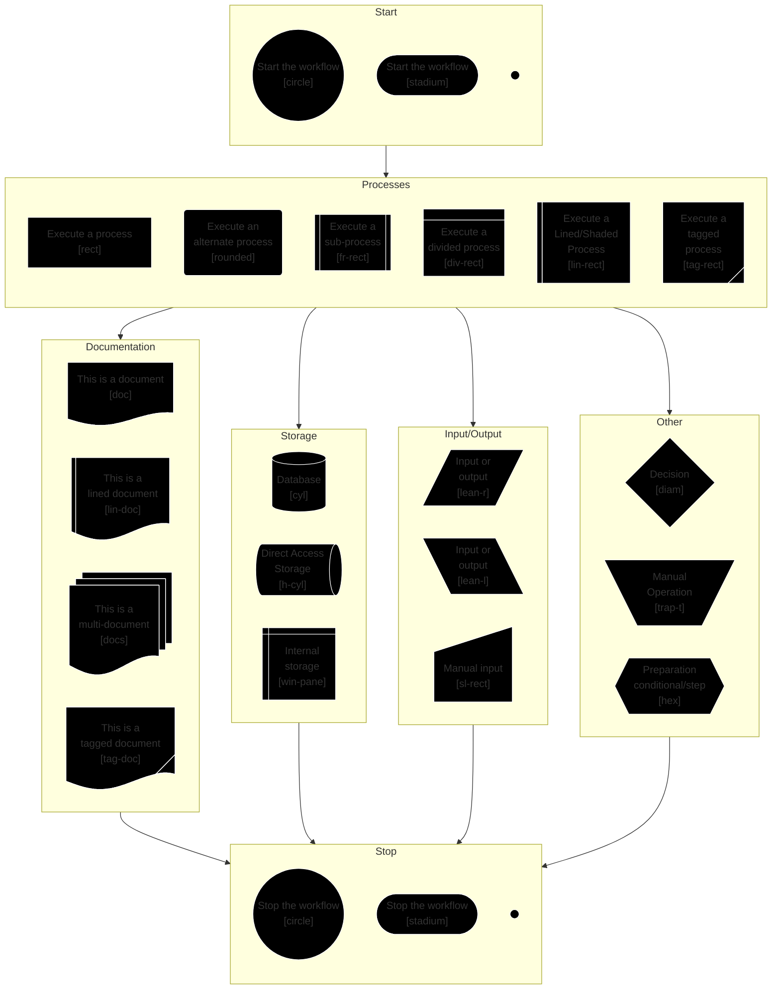
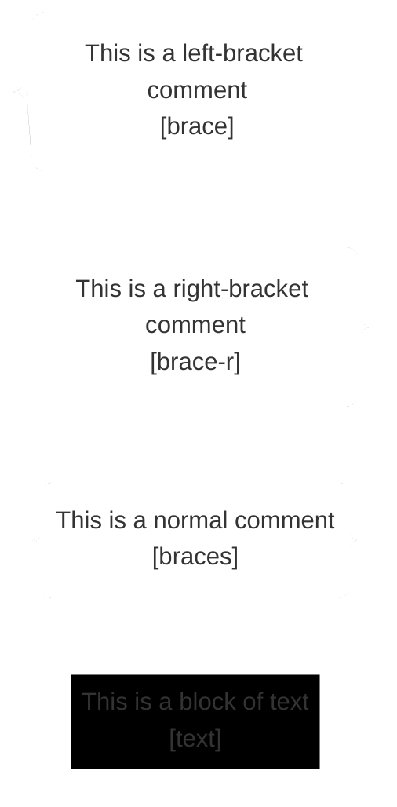
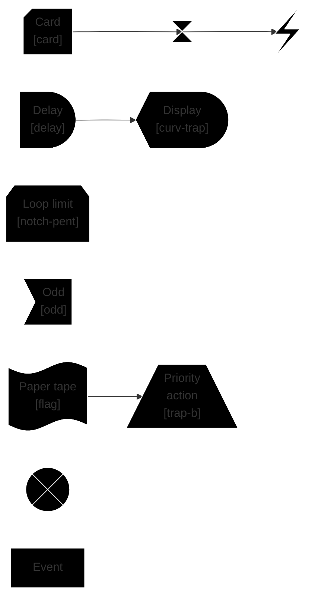

# Mermaid shapes

## Workflows

```mermaid
flowchart TB

    subgraph StartWorkflow ["Start"]
        direction TB
        %% Components
        Start@{shape: circle, label: "Start the workflow\n[circle]"}
        TerminalStart@{shape: stadium, label: "Start the workflow\n[stadium]"}
        StartSmall@{shape: sm-circ, label: "Start the workflow\n[sm-circ]"}
        %% Layout : none
        %% Styles : global
    end

    subgraph ProcessWorkflow ["Processes"]
        direction TB
        %% Components
        Process@{shape: rect, label: "Execute a process\n[rect]"}
        AlternativeProcess@{shape: rounded, label: "Execute an\nalternate process\n[rounded]"}
        SubProcess@{shape: fr-rect, label: "Execute a\nsub-process\n[fr-rect]"}
        DividedProcess@{shape: div-rect, label: "Execute a\ndivided process\n[div-rect]"}
        LinedShadedProcess@{shape: lin-rect, label: "Execute a\nLined/Shaded\nProcess\n[lin-rect]"}
        TaggedProcess@{shape: tag-rect, label: "Execute a\ntagged\nprocess\n[tag-rect]"}
        %% Layout : none
        %% Styles : global
    end
    
    subgraph DocumentationWorkflow ["Documentation"]
        direction LR
        %% Components
        Document@{shape: doc, label: "This is a document\n[doc]"}
        LinedDocument@{shape: lin-doc, label: "This is a\nlined document\n[lin-doc]"}
        MultiDocument@{shape: docs, label: "This is a\nmulti-document\n[docs]"}
        TaggedDocument@{shape: tag-doc, label: "This is a\ntagged document\n[tag-doc]"}
        %% Layout : none
        %% Styles : global
    end

    subgraph StorageWorkflow ["Storage"]
        direction LR
        %% Components
        Database@{shape: cyl, label: "Database\n[cyl]"}
        DirectAccessStorage@{shape: h-cyl, label: "Direct Access\nStorage\n[h-cyl]"}
        InternalStorage@{shape: win-pane, label: "Internal\nstorage\n[win-pane]"}
        %% Layout : none
        %% Styles : global
    end

    subgraph InputOutputWorkflow ["Input/Output"]
        direction LR
        %% Components
        DataInputOutputRight@{shape: lean-r, label: "Input or\noutput\n[lean-r]"}
        DataInputOutputLeft@{shape: lean-l, label: "Input or\noutput\n[lean-l]"}
        ManualInput@{shape: sl-rect, label: "Manual input\n[sl-rect]"}
        %% Layout : none
        %% Styles : global
    end

    subgraph OtherWorkflow ["Other"]
        direction LR
        %% Components
        Decision@{shape: diam, label: "Decision\n[diam]"}
        ManualOperation@{shape: trap-t, label: "Manual\nOperation\n[trap-t]"}
        PrepareConditional@{shape: hex, label: "Preparation\nconditional/step\n[hex]"}
        %% Layout : none
        %% Styles : global
    end

    subgraph StopWorkflow ["Stop"]
        direction TB
        %% Components
        Stop@{shape: circle, label: "Stop the workflow\n[circle]"}
        TerminalStop@{shape: stadium, label: "Stop the workflow\n[stadium]"}
        StopSmall@{shape: sm-circ, label: "Stop the workflow\n[sm-circ]"}
        %% Layout : none
        %% Styles : global
    end

    %% Layout
    StartWorkflow --> ProcessWorkflow
    ProcessWorkflow --> DocumentationWorkflow
    ProcessWorkflow --> StorageWorkflow
    ProcessWorkflow --> InputOutputWorkflow
    ProcessWorkflow --> OtherWorkflow
    DocumentationWorkflow --> StopWorkflow
    StorageWorkflow --> StopWorkflow
    InputOutputWorkflow --> StopWorkflow
    OtherWorkflow --> StopWorkflow
    %% Styles
    classDef default fill:#000, stroke:#FFF, stroke-width:1px
```

## Comments and text

```mermaid
flowchart LR
    %% Components
    Comment@{shape: brace, label: "This is a left-bracket comment\n[brace]"}
    CommentRight@{shape: brace-r, label: "This is a right-bracket comment\n[brace-r]"}
    CommentBoth@{shape: braces, label: "This is a normal comment\n[braces]"}
    TextBlock@{shape: text, label: "This is a block of text\n[text]"}
    %% Layout
    Comment
    CommentRight
    CommentBoth
    TextBlock
    %% Styles
    classDef default fill:#000, stroke:#FFF, stroke-width:1px
```

# Other

```mermaid
flowchart LR
    %% Components
    Card@{shape: card, label: "Card\n[card]"}
    Collate@{shape: hourglass, label: "Collate\noperation\n[hourglass]"}
    ComLink@{shape: bolt, label: "Communication\nlink\n[bolt]"}
    Delay@{shape: delay, label: "Delay\n[delay]"}
    Display@{shape: curv-trap, label: "Display\n[curv-trap]"}
    LoopLimit@{shape: notch-pent, label: "Loop limit\n[notch-pent]"}
    Odd@{shape: odd, label: "Odd\n[odd]"}
    PaperTape@{shape: flag, label: "Paper tape\n[flag]"}
    PriorityAction@{shape: trap-b, label: "Priority\naction\n[trap-b]"}
    Summary@{shape: cross-circ, label: "Summary\n[cross-circ]"}
    
    %% Layout
    Card --> Collate --> ComLink
    Delay -->Display
    Event
    LoopLimit
    Odd
    PaperTape --> PriorityAction
    Summary
    %% Styles
    classDef default fill:#000, stroke:#FFF, stroke-width:1px
```
-->