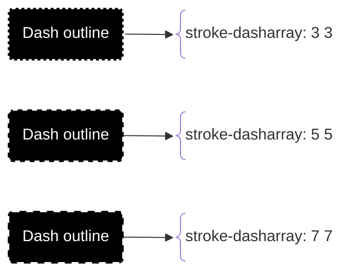

<!-- u250303  -->

# Mermaid: Strokes

```mermaid
flowchart LR
  %% Components
  Dash3_3@{shape: rounded, label: "Dash outline"}
  Dash3_3String@{shape: brace, label: "stroke-dasharray: 3 3"}
  Dash5_5@{shape: rounded, label: "Dash outline"}
  Dash5_5String@{shape: brace, label: "stroke-dasharray: 5 5"}
  Dash7_7@{shape: rounded, label: "Dash outline"}
  Dash7_7String@{shape: brace, label: "stroke-dasharray: 7 7"}
  %% Layout
  Dash3_3 --> Dash3_3String
  Dash5_5 --> Dash5_5String
  Dash7_7 --> Dash7_7String
  %% Styles
  classDef Dash3_3 stroke:#ffffff,stroke-width:3px,stroke-dasharray: 3 3,fill:#000000,color:#ffffff
  class Dash3_3 Dash3_3
  classDef Dash5_5 stroke:#ffffff,stroke-width:3px,stroke-dasharray: 5 5,fill:#000000,color:#ffffff
  class Dash5_5 Dash5_5
  classDef Dash7_7 stroke:#ffffff,stroke-width:3px,stroke-dasharray: 7 7,fill:#000000,color:#ffffff
  class Dash7_7 Dash7_7
```
