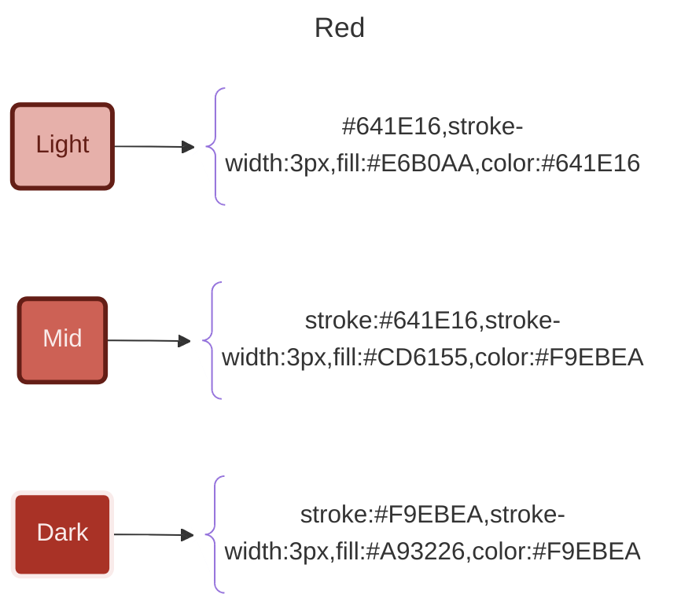
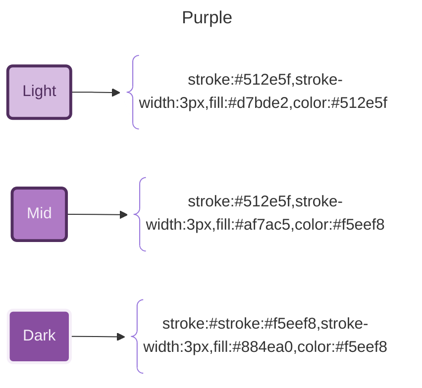
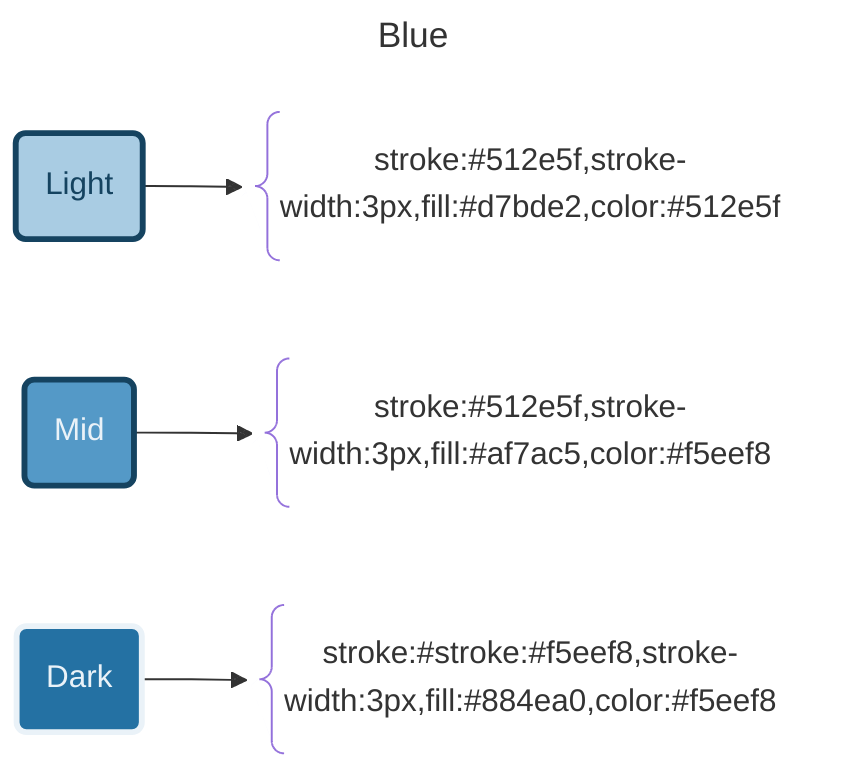
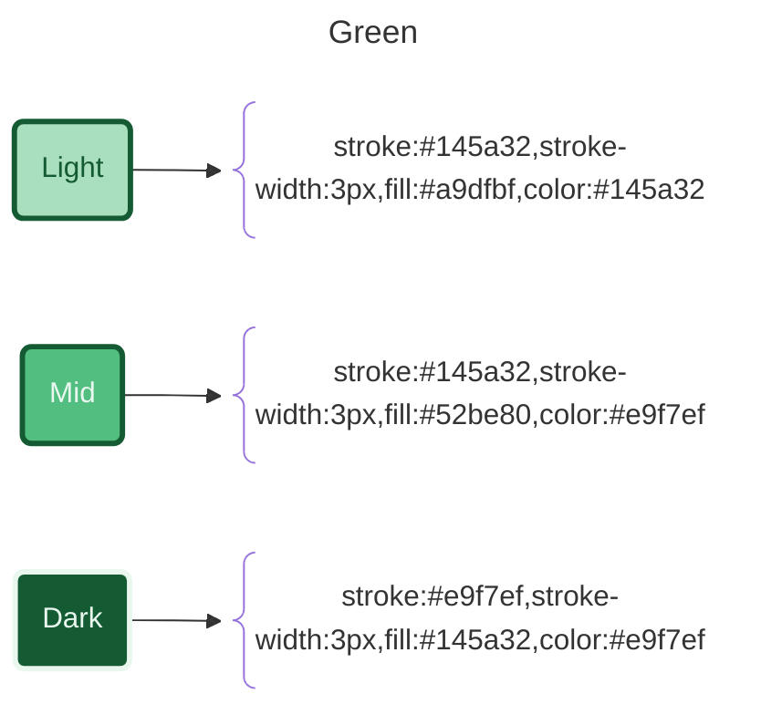
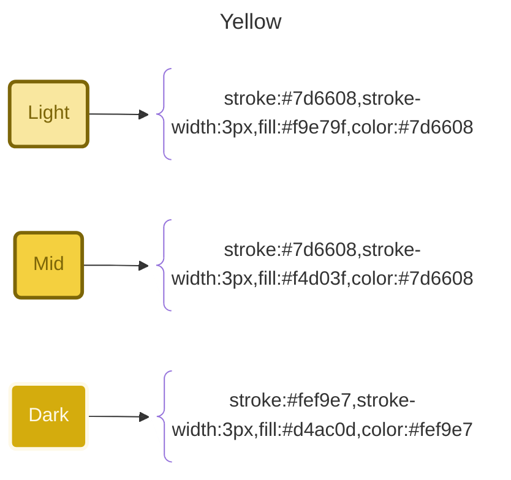
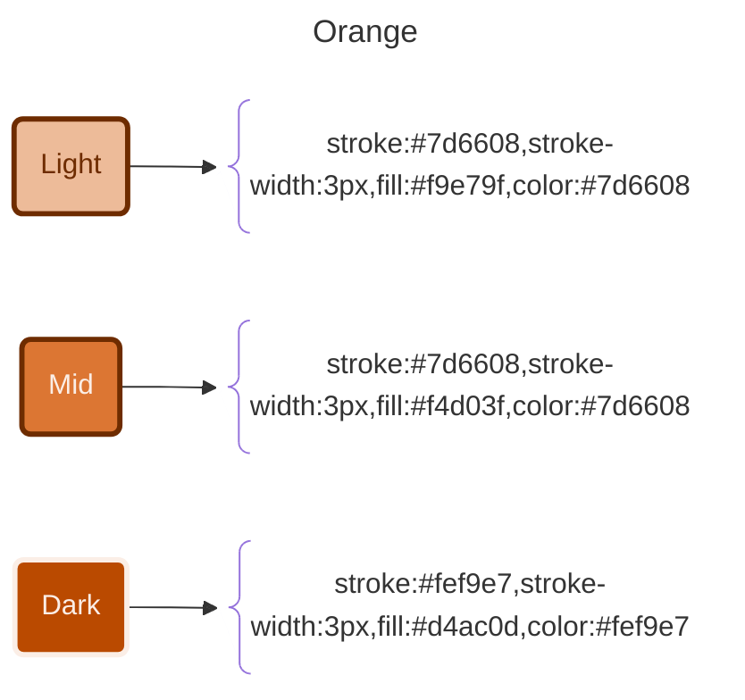
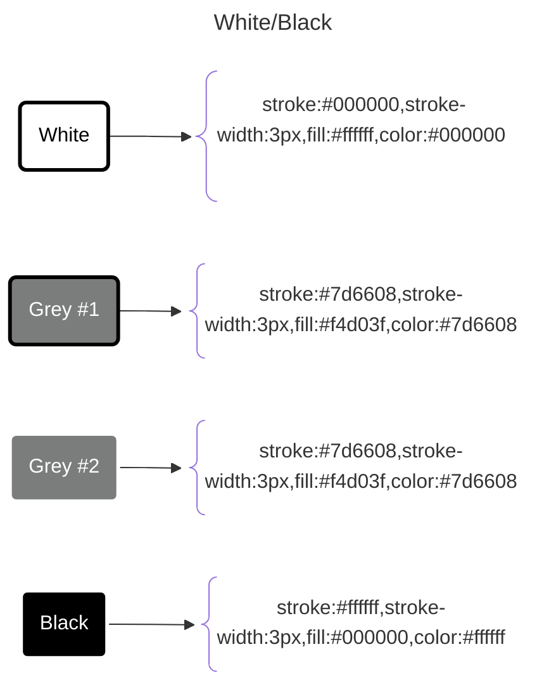

<!-- u250303  -->

# Mermaid

## Shapes and workflows

```mermaid
flowchart TB

    subgraph StartWorkflow ["Start"]
        direction TB
        %% Components
        Start@{shape: circle, label: "Start the workflow\n[circle]"}
        TerminalStart@{shape: stadium, label: "Start the workflow\n[stadium]"}
        StartSmall@{shape: sm-circ, label: "Start the workflow\n[sm-circ]"}
        Comment@{shape: brace, label: "[sm-circ]"}
        %% Layout : none
        %% Styles : global
    end

    subgraph ProcessWorkflow ["Processes"]
        direction TB
        %% Components
        Process@{shape: rect, label: "Execute a process\n[rect]"}
        AlternativeProcess@{shape: rounded, label: "Execute an\nalternate process\n[rounded]"}
        SubProcess@{shape: fr-rect, label: "Execute a\nsub-process\n[fr-rect]"}
        DividedProcess@{shape: div-rect, label: "Execute a\ndivided process\n[div-rect]"}
        LinedShadedProcess@{shape: lin-rect, label: "Execute a\nLined/Shaded\nProcess\n[lin-rect]"}
        TaggedProcess@{shape: tag-rect, label: "Execute a\ntagged\nprocess\n[tag-rect]"}
        %% Layout : none
        %% Styles : global
    end
    
    subgraph DocumentationWorkflow ["Documentation"]
        direction LR
        %% Components
        Document@{shape: doc, label: "This is a document\n[doc]"}
        LinedDocument@{shape: lin-doc, label: "This is a\nlined document\n[lin-doc]"}
        MultiDocument@{shape: docs, label: "This is a\nmulti-document\n[docs]"}
        TaggedDocument@{shape: tag-doc, label: "This is a\ntagged document\n[tag-doc]"}
        %% Layout : none
        %% Styles : global
    end

    subgraph StorageWorkflow ["Storage"]
        direction LR
        %% Components
        Database@{shape: cyl, label: "Database\n[cyl]"}
        DirectAccessStorage@{shape: h-cyl, label: "Direct Access\nStorage\n[h-cyl]"}
        InternalStorage@{shape: win-pane, label: "Internal\nstorage\n[win-pane]"}
        %% Layout : none
        %% Styles : global
    end

    subgraph InputOutputWorkflow ["Input/Output"]
        direction LR
        %% Components
        DataInputOutputRight@{shape: lean-r, label: "Input or\noutput\n[lean-r]"}
        DataInputOutputLeft@{shape: lean-l, label: "Input or\noutput\n[lean-l]"}
        ManualInput@{shape: sl-rect, label: "Manual input\n[sl-rect]"}
        %% Layout : none
        %% Styles : global
    end

    subgraph OtherWorkflow ["Other"]
        direction LR
        %% Components
        Decision@{shape: diam, label: "Decision\n[diam]"}
        ManualOperation@{shape: trap-t, label: "Manual\nOperation\n[trap-t]"}
        PrepareConditional@{shape: hex, label: "Preparation\nconditional/step\n[hex]"}
        %% Layout : none
        %% Styles : global
    end

    subgraph StopWorkflow ["Stop"]
        direction TB
        %% Components
        Stop@{shape: circle, label: "Stop the workflow\n[circle]"}
        TerminalStop@{shape: stadium, label: "Stop the workflow\n[stadium]"}
        StopSmall@{shape: fr-circ, label: "Stop the workflow\n[fr-circ]"}
        Comment@{shape: brace, label: "[fr-circ]"}
        %% Layout : none
        %% Styles : global
    end

    %% Layout
    StartWorkflow --> ProcessWorkflow
    ProcessWorkflow --> DocumentationWorkflow
    ProcessWorkflow --> StorageWorkflow
    ProcessWorkflow --> InputOutputWorkflow
    ProcessWorkflow --> OtherWorkflow
    DocumentationWorkflow --> StopWorkflow
    StorageWorkflow --> StopWorkflow
    InputOutputWorkflow --> StopWorkflow
    OtherWorkflow --> StopWorkflow
    %% Styles
    classDef default fill:#000, stroke:#FFF, stroke-width:1px
```

## Comments and text

```mermaid
flowchart LR
    %% Components
    Comment@{shape: brace, label: "This is a left-bracket comment\n[brace]"}
    CommentRight@{shape: brace-r, label: "This is a right-bracket comment\n[brace-r]"}
    CommentBoth@{shape: braces, label: "This is a normal comment\n[braces]"}
    TextBlock@{shape: text, label: "This is a block of text\n[text]"}
    %% Layout
    Comment
    CommentRight
    CommentBoth
    TextBlock
    %% Styles
    classDef default fill:#000, stroke:#FFF, stroke-width:1px
```

# Other

```mermaid
flowchart LR
    %% Components
    Card@{shape: card, label: "Card\n[card]"}
    Collate@{shape: hourglass, label: "Collate\noperation\n[hourglass]"}
    ComLink@{shape: bolt, label: "Communication\nlink\n[bolt]"}
    Delay@{shape: delay, label: "Delay\n[delay]"}
    Display@{shape: curv-trap, label: "Display\n[curv-trap]"}
    LoopLimit@{shape: notch-pent, label: "Loop limit\n[notch-pent]"}
    Odd@{shape: odd, label: "Odd\n[odd]"}
    PaperTape@{shape: flag, label: "Paper tape\n[flag]"}
    PriorityAction@{shape: trap-b, label: "Priority\naction\n[trap-b]"}
    Summary@{shape: cross-circ, label: "Summary\n[cross-circ]"}
    
    %% Layout
    Card --> Collate --> ComLink
    Delay -->Display
    Event
    LoopLimit
    Odd
    PaperTape --> PriorityAction
    Summary
    %% Styles
    classDef default fill:#000, stroke:#FFF, stroke-width:1px
```

***
 
 

# COLORS

```mermaid
---
title: Red
---
flowchart LR
  %% Components
  Light@{shape: rounded, label: "Light"}
  LightString@{shape: brace, label: "#641E16,stroke-width:3px,fill:#E6B0AA,color:#641E16"}
  Mid@{shape: rounded, label: "Mid"}
  MidString@{shape: brace, label: "stroke:#641E16,stroke-width:3px,fill:#CD6155,color:#F9EBEA"}
  Dark@{shape: rounded, label: "Dark"}
  DarkString@{shape: brace, label: "stroke:#F9EBEA,stroke-width:3px,fill:#A93226,color:#F9EBEA"}
  %% Layout
  Light --> LightString
  Mid --> MidString
  Dark --> DarkString
  %% Styles
  classDef Light stroke:#641E16,stroke-width:3px,fill:#E6B0AA,color:#641E16
  classDef Mid stroke:#641E16,stroke-width:3px,fill:#CD6155,color:#F9EBEA
  classDef Dark stroke:#F9EBEA,stroke-width:3px,fill:#A93226,color:#F9EBEA
  class Light Light
  class Mid Mid
  class Dark Dark
```

```mermaid
---
title: Purple
---
flowchart LR
  %% Components
  Light@{shape: rounded, label: "Light"}
  LightString@{shape: brace, label: "stroke:#512e5f,stroke-width:3px,fill:#d7bde2,color:#512e5f "}
  Mid@{shape: rounded, label: "Mid"}
  MidString@{shape: brace, label: "stroke:#512e5f,stroke-width:3px,fill:#af7ac5,color:#f5eef8"}
  Dark@{shape: rounded, label: "Dark"}
  DarkString@{shape: brace, label: "stroke:#stroke:#f5eef8,stroke-width:3px,fill:#884ea0,color:#f5eef8"}
  %% Layout
  Light --> LightString
  Mid --> MidString
  Dark --> DarkString
  %% Styles
  classDef Light stroke:#512e5f,stroke-width:3px,fill:#d7bde2,color:#512e5f 
  classDef Mid stroke:#512e5f,stroke-width:3px,fill:#af7ac5,color:#f5eef8
  classDef Dark stroke:#f5eef8,stroke-width:3px,fill:#884ea0,color:#f5eef8
  class Light Light
  class Mid Mid
  class Dark Dark
```

```mermaid
---
title: Blue
---
flowchart LR
  %% Components
  Light@{shape: rounded, label: "Light"}
  LightString@{shape: brace, label: "stroke:#512e5f,stroke-width:3px,fill:#d7bde2,color:#512e5f"}
  Mid@{shape: rounded, label: "Mid"}
  MidString@{shape: brace, label: "stroke:#512e5f,stroke-width:3px,fill:#af7ac5,color:#f5eef8"}
  Dark@{shape: rounded, label: "Dark"}
  DarkString@{shape: brace, label: "stroke:#stroke:#f5eef8,stroke-width:3px,fill:#884ea0,color:#f5eef8"}
  %% Layout
  Light --> LightString
  Mid --> MidString
  Dark --> DarkString
  %% Styles
  classDef Light stroke:#154360,stroke-width:3px,fill:#a9cce3,color:#154360  
  classDef Mid stroke:#154360,stroke-width:3px,fill:#5499c7,color:#eaf2f8
  classDef Dark stroke:#eaf2f8,stroke-width:3px,fill:#2471a3,color:#eaf2f8
  class Light Light
  class Mid Mid
  class Dark Dark
```

```mermaid
---
title: Green
---
flowchart LR
  %% Components
  Light@{shape: rounded, label: "Light"}
  LightString@{shape: brace, label: "stroke:#145a32,stroke-width:3px,fill:#a9dfbf,color:#145a32"}
  Mid@{shape: rounded, label: "Mid"}
  MidString@{shape: brace, label: "stroke:#145a32,stroke-width:3px,fill:#52be80,color:#e9f7ef"}
  Dark@{shape: rounded, label: "Dark"}
  DarkString@{shape: brace, label: "stroke:#e9f7ef,stroke-width:3px,fill:#145a32,color:#e9f7ef"}
  %% Layout
  Light --> LightString
  Mid --> MidString
  Dark --> DarkString
  %% Styles
  classDef Light stroke:#145a32,stroke-width:3px,fill:#a9dfbf,color:#145a32  
  classDef Mid stroke:#145a32,stroke-width:3px,fill:#52be80,color:#e9f7ef
  classDef Dark stroke:#e9f7ef,stroke-width:3px,fill:#145a32,color:#e9f7ef
  class Light Light
  class Mid Mid
  class Dark Dark
```

```mermaid
---
title: Yellow
---
flowchart LR
  %% Components
  Light@{shape: rounded, label: "Light"}
  LightString@{shape: brace, label: "stroke:#7d6608,stroke-width:3px,fill:#f9e79f,color:#7d6608"}
  Mid@{shape: rounded, label: "Mid"}
  MidString@{shape: brace, label: "stroke:#7d6608,stroke-width:3px,fill:#f4d03f,color:#7d6608"}
  Dark@{shape: rounded, label: "Dark"}
  DarkString@{shape: brace, label: "stroke:#fef9e7,stroke-width:3px,fill:#d4ac0d,color:#fef9e7"}
  %% Layout
  Light --> LightString
  Mid --> MidString
  Dark --> DarkString
  %% Styles
  classDef Light stroke:#7d6608,stroke-width:3px,fill:#f9e79f,color:#7d6608  
  classDef Mid stroke:#7d6608,stroke-width:3px,fill:#f4d03f,color:#7d6608
  classDef Dark stroke:#fef9e7,stroke-width:3px,fill:#d4ac0d,color:#fef9e7
  class Light Light
  class Mid Mid
  class Dark Dark
```

```mermaid
---
title: Orange
---
flowchart LR
  %% Components
  Light@{shape: rounded, label: "Light"}
  LightString@{shape: brace, label: "stroke:#7d6608,stroke-width:3px,fill:#f9e79f,color:#7d6608"}
  Mid@{shape: rounded, label: "Mid"}
  MidString@{shape: brace, label: "stroke:#7d6608,stroke-width:3px,fill:#f4d03f,color:#7d6608"}
  Dark@{shape: rounded, label: "Dark"}
  DarkString@{shape: brace, label: "stroke:#fef9e7,stroke-width:3px,fill:#d4ac0d,color:#fef9e7"}
  %% Layout
  Light --> LightString
  Mid --> MidString
  Dark --> DarkString
  %% Styles
  classDef Light stroke:#6e2c00,stroke-width:3px,fill:#edbb99,color:#6e2c00  
  classDef Mid stroke:#6e2c00,stroke-width:3px,fill:#dc7633,color:#fbeee6
  classDef Dark stroke:#fbeee6,stroke-width:3px,fill:#ba4a00,color:#fbeee6
  class Light Light
  class Mid Mid
  class Dark Dark
```

```mermaid
---
title: White/Black
---
flowchart LR
  %% Components
  White@{shape: rounded, label: "White"}
  WhiteString@{shape: brace, label: "stroke:#000000,stroke-width:3px,fill:#ffffff,color:#000000  "}
  GreyOne@{shape: rounded, label: "Grey #1"}
  GreyOneString@{shape: brace, label: "stroke:#7d6608,stroke-width:3px,fill:#f4d03f,color:#7d6608"}
  GreyTwo@{shape: rounded, label: "Grey #2"}
  GreyTwoString@{shape: brace, label: "stroke:#7d6608,stroke-width:3px,fill:#f4d03f,color:#7d6608"}
  Black@{shape: rounded, label: "Black"}
  BlackString@{shape: brace, label: "stroke:#ffffff,stroke-width:3px,fill:#000000,color:#ffffff"}
  %% Layout
  White --> WhiteString
  GreyOne --> GreyOneString
  GreyTwo --> GreyTwoString
  Black --> BlackString
  %% Styles
  classDef White stroke:#000000,stroke-width:3px,fill:#ffffff,color:#000000  
  classDef GreyOne stroke:#000000,stroke-width:3px,fill:#7b7d7d,color:#ffffff
  classDef GreyTwo stroke:#FFFFFF,stroke-width:3px,fill:#7b7d7d,color:#ffffff
  classDef Black stroke:#ffffff,stroke-width:3px,fill:#000000,color:#ffffff
  class White White
  class GreyOne GreyOne
  class GreyTwo GreyTwo
  class Black Black
```