<!-- u250303  -->

# Mermaid

## Shapes and workflows


## Comments and text


# Other


# Links

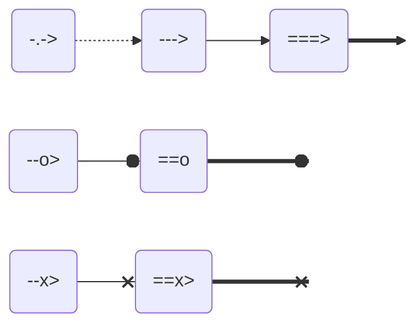

***
<br>
<br>

# COLORS

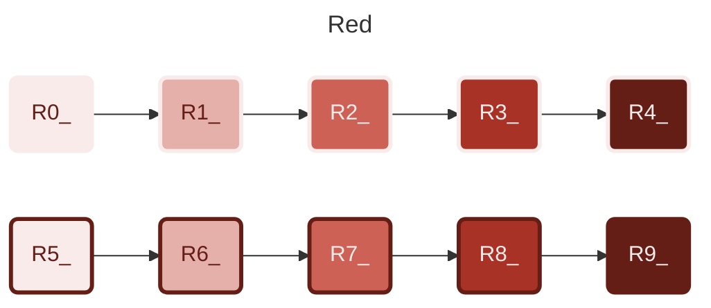

```text
  classDef R0_ stroke:#f9ebea,stroke-width:3px,fill:#f9ebea,color:#641e16
  classDef R1_ stroke:#f9ebea,stroke-width:3px,fill:#E6B0AA,color:#641e16
  classDef R2_ stroke:#f9ebea,stroke-width:3px,fill:#CD6155,color:#f9ebea
  classDef R3_ stroke:#f9ebea,stroke-width:3px,fill:#A93226,color:#f9ebea
  classDef R4_ stroke:#f9ebea,stroke-width:3px,fill:#641e16,color:#f9ebea
  classDef R5_ stroke:#641e16,stroke-width:3px,fill:#f9ebea,color:#641e16
  classDef R6_ stroke:#641e16,stroke-width:3px,fill:#E6B0AA,color:#641e16
  classDef R7_ stroke:#641e16,stroke-width:3px,fill:#CD6155,color:#f9ebea
  classDef R8_ stroke:#641e16,stroke-width:3px,fill:#A93226,color:#f9ebea
  classDef R9_ stroke:#641e16,stroke-width:3px,fill:#641e16,color:#f9ebea
```

</details>


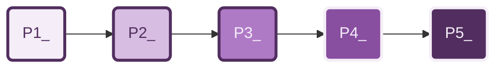

```text
  classDef P1_ stroke:#512e5f,stroke-width:3px,fill:#f5eef8,color:#512e5f
  classDef P2_ stroke:#512e5f,stroke-width:3px,fill:#d7bde2,color:#512e5f
  classDef P3_ stroke:#512e5f,stroke-width:3px,fill:#af7ac5,color:#f5eef8
  classDef P4_ stroke:#f5eef8,stroke-width:3px,fill:#884ea0,color:#f5eef8
  classDef P5_ stroke:#f5eef8,stroke-width:3px,fill:#512e5f,color:#f5eef8
```

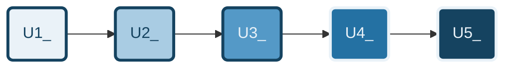

```text
  classDef B1_ stroke:#154360,stroke-width:3px,fill:#eaf2f8,color:#154360
  classDef B2_ stroke:#154360,stroke-width:3px,fill:#a9cce3,color:#154360
  classDef B3_ stroke:#154360,stroke-width:3px,fill:#5499c7,color:#eaf2f8
  classDef B4_ stroke:#eaf2f8,stroke-width:3px,fill:#2471a3,color:#eaf2f8
  classDef B5_ stroke:#eaf2f8,stroke-width:3px,fill:#154360,color:#eaf2f8
```

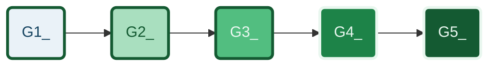

```text
  classDef B1_ stroke:#154360,stroke-width:3px,fill:#eaf2f8,color:#154360
  classDef B2_ stroke:#154360,stroke-width:3px,fill:#a9cce3,color:#154360
  classDef B3_ stroke:#154360,stroke-width:3px,fill:#5499c7,color:#eaf2f8
  classDef B4_ stroke:#eaf2f8,stroke-width:3px,fill:#2471a3,color:#eaf2f8
  classDef B5_ stroke:#eaf2f8,stroke-width:3px,fill:#154360,color:#eaf2f8
```

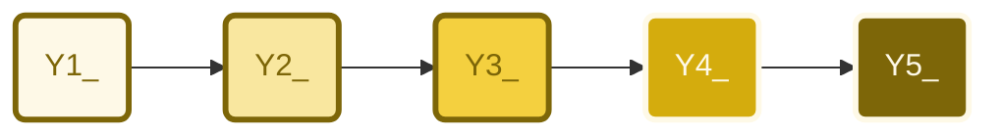
```text
  classDef Y1_ stroke:#7d6608,stroke-width:3px,fill:#fef9e7,color:#7d6608
  classDef Y2_ stroke:#7d6608,stroke-width:3px,fill:#f9e79f,color:#7d6608
  classDef Y3_ stroke:#7d6608,stroke-width:3px,fill:#f4d03f,color:#7d6608
  classDef Y4_ stroke:#fef9e7,stroke-width:3px,fill:#d4ac0d,color:#fef9e7
  classDef Y5_ stroke:#fef9e7,stroke-width:3px,fill:#7d6608,color:#fef9e7
```

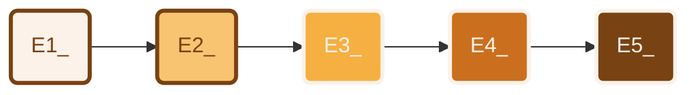

```text
  classDef E1_ stroke:#784212,stroke-width:3px,fill:#fdf2e9,color:#784212
  classDef E2_ stroke:#784212,stroke-width:3px,fill:#f8c471,color:#784212  
  classDef E3_ stroke:#fdf2e9,stroke-width:3px,fill:#f5b041,color:#fdf2e9
  classDef E4_ stroke:#fdf2e9,stroke-width:3px,fill:#ca6f1e,color:#fdf2e9
  classDef E5_ stroke:#fdf2e9,stroke-width:3px,fill:#784212,color:#fdf2e9
```

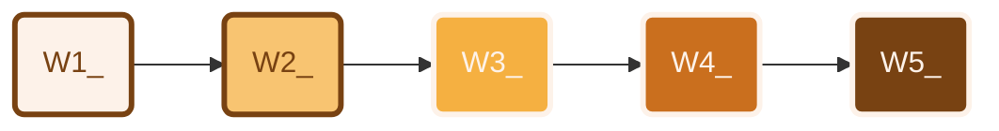

```text
  classDef E1_ stroke:#784212,stroke-width:3px,fill:#fdf2e9,color:#784212
  classDef E2_ stroke:#784212,stroke-width:3px,fill:#f8c471,color:#784212  
  classDef E3_ stroke:#fdf2e9,stroke-width:3px,fill:#f5b041,color:#fdf2e9
  classDef E4_ stroke:#fdf2e9,stroke-width:3px,fill:#ca6f1e,color:#fdf2e9
  classDef E5_ stroke:#fdf2e9,stroke-width:3px,fill:#784212,color:#fdf2e9
```


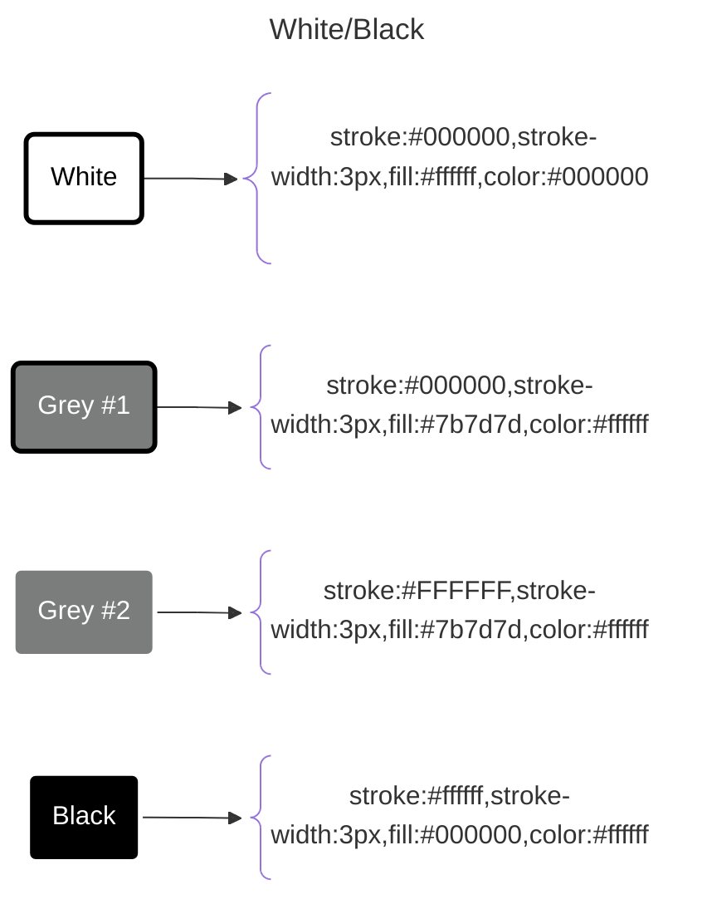

## Outline

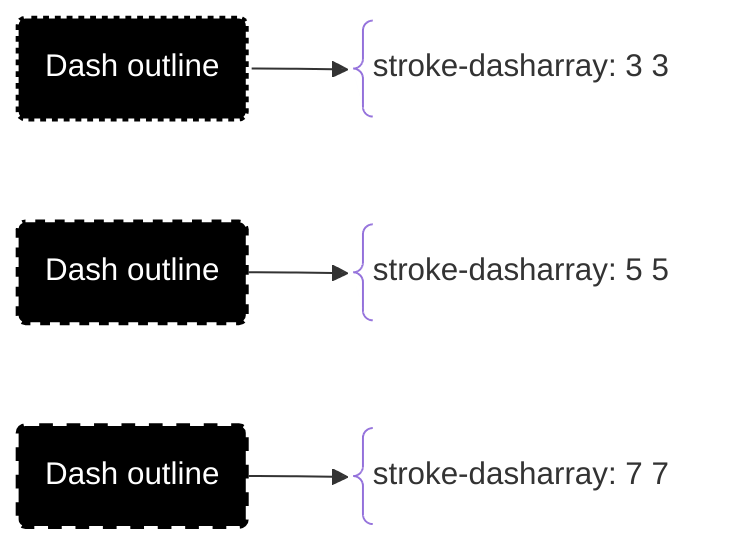

## Font size

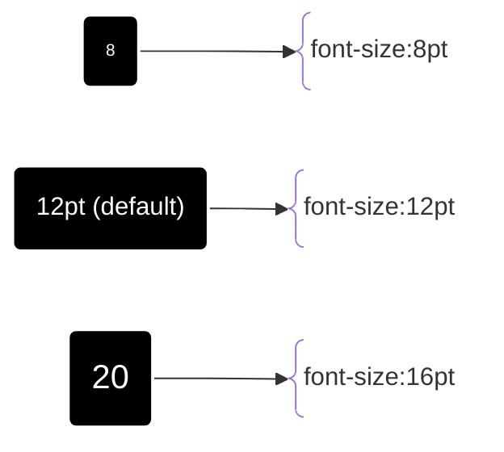
